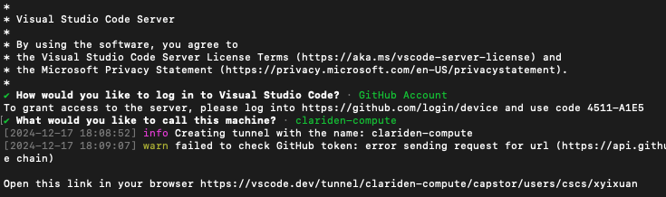

1. Install VS Code CLI on Clariden login node (one time operation)

   ```bash
   curl -L -o code.tar.gz "https://code.visualstudio.com/sha/download?build=stable&os=cli-alpine-arm64"
   mkdir vscode-cli
   tar -xf code.tar.gz -C vscode-cli
   ```

2. If you haven't do so:
    ```bash
    # Create .edf directory if it doesn't exist
    mkdir -p ~/.edf

    # Create and write to nemo.toml
    cat > ~/.edf/nemo.toml << 'EOL'
    image = "/capstor/store/cscs/swissai/a06/.NeMo/container/nemo_p.sqsh"
    mounts = ["/capstor", "/iopsstor", "/users"]
    writable = true
    workdir = "/capstor/users/cscs/xyixuan" # Change to your username

    [annotations]
    com.hooks.aws_ofi_nccl.enabled = "true"
    com.hooks.aws_ofi_nccl.variant = "cuda12"

    [env]
    CUDA_CACHE_DISABLE = "1"
    NCCL_NET = "AWS Libfabric"
    NCCL_CROSS_NIC = "1"
    NCCL_NET_GDR_LEVEL = "PHB"
    FI_CXI_DISABLE_HOST_REGISTER = "1"
    FI_MR_CACHE_MONITOR = "userfaultfd"
    FI_CXI_DEFAULT_CQ_SIZE = "131072"
    FI_CXI_DEFAULT_TX_SIZE = "32768"
    FI_CXI_RX_MATCH_MODE = "software"
    FI_CXI_SAFE_DEVMEM_COPY_THRESHOLD = "16777216"
    FI_CXI_COMPAT = "0"
    EOL
    ```

3.  Start a VS Code Server tunnel in a computing node

    ```bash
    srun --time 12:00:00 --environment nemo  --container-mounts=./vscode-cli/code:/code --pty /code tunnel --accept-server-license-terms
    ```

4. When the VS Code login prompt appears, select <span style="color: #00ff00">GitHub Account</span> to proceed. On your first login, you'll be prompted to create a tunnel name. After successful authentication, you can connect VS Code to the container in two ways:
    1. Visit the direct link provided in your terminal, or
    2. Use VS Code's Remote Explorer under the "Tunnels" section

    
    

5. Create your debug `launch.json` file, e.g.:

   ```json
   {
       // Use IntelliSense to learn about possible attributes.
       // Hover to view descriptions of existing attributes.
       // For more information, visit: https://go.microsoft.com/fwlink/?linkid=830387
       "version": "0.2.0",
       "configurations": 
       [
           {
               "name": "Python Debugger: Figure out data mixing",
               "type": "debugpy",
               "request": "launch",
               "console": "integratedTerminal",
               "python": "/usr/bin/python3",
               "justMyCode": false,
               "env": {
                   "TRANSFORMERS_OFFLINE": "0",
                   "TORCH_NCCL_AVOID_RECORD_STREAMS": "1",
                   "CUDA_DEVICE_MAX_CONNECTIONS": "1",
                   "CUDA_VISIBLE_DEVICES": "0",
                   "PYTHONPATH": "${workspaceFolder}/NeMo:/opt/Megatron-LM"
            },
               },
               "module": "torch.distributed.run",
               "args": [
                "${workspaceFolder}/NeMo/examples/nlp/language_modeling/megatron_gpt_pretraining.py",
                "--config-path", "${workspaceFolder}/PDM/debug/rcp",
                "--config-name", "goldfish_debug.yaml",
                "llama_param_size=1.5B",
                "run.name=llama_1.5B_Goldfish_K_54_H_13_GBS_120_EPOCH_76",
                "run.results_dir=${workspaceFolder}/debug/Goldfish_K_54_H_13/GBS_120_EPOCH_76",
                "model.global_batch_size=120",
                "model.data.goldfish_loss=true",
                "model.data.goldfish_h=13",
                "model.data.goldfish_k=54",
                "model.gc_interval=100",
                "exp_manager.checkpoint_callback_params.every_n_train_steps=75",
                "trainer.max_steps=5700"
               ]
           }
       ]
   }
   ```
6. Save and Export Breakpoints:
    * Install the [breakpointIO](https://github.com/redspart/breakpoint-io) extension in VS Code.
    * Press `Cmd + Shift + P` (Mac) or `Ctrl + Shift + P` (Windows/Linux) to open command palette, and type `breakpointio-export` to save your breakpoints to [breakpoints.json](../debug/rcp/breakpoints.json) under `.vscode` folder on your remote cluster. 
    * To restore the breakpoints later, open the command palette again and run `breakpointio-import`.

### Troubleshooting
---
1. Since [NeMo](https://github.com/TJ-Solergibert/NeMo) imports [Megatron-LM](https://github.com/TJ-Solergibert/Megatron-LM/tree/goldfish), you may find that your debugger steps into the Megatron-LM framework. In subsequent debugging sessions—when you’ve run `breakpointio-import` you might see a <span style="color: #ff0000">The editor could not be opened because the file was not found</span> error if the Megatron-LM source files are inaccessible. To fix this issue:
    
    * Create a symbolic link to Megatron-LM under your workspace directory:
        ```bash
        ln -s /opt/Megatron-LM Megatron-LM
        ```
    *  Then update your PYTHONPATH in `launch.json` to use the symbolic link instead:
        ```json
        "PYTHONPATH": "${workspaceFolder}/NeMo:${workspaceFolder}/Megatron-LM"
        ```